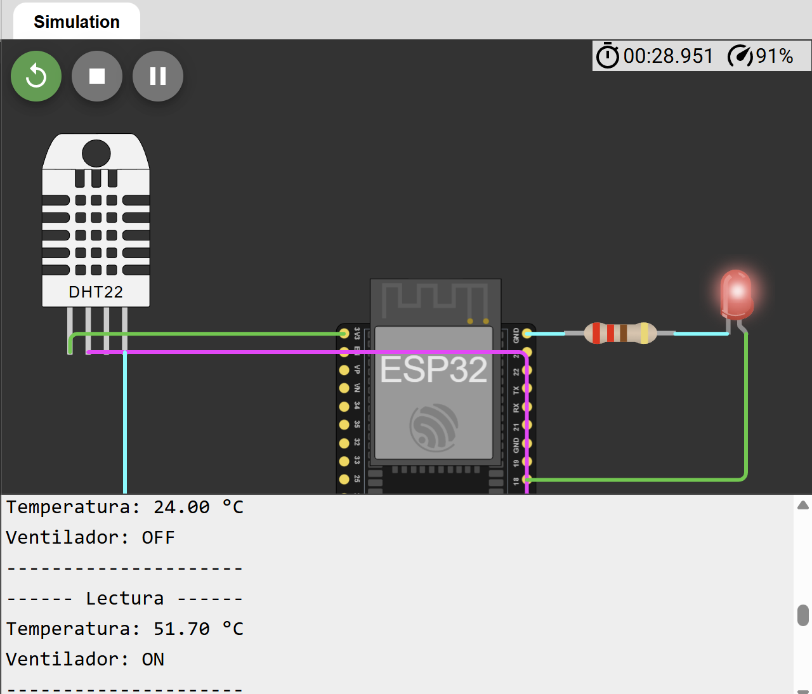

# Control Automático de Ventilador con ESP32

## Descripción

Proyecto IoT desarrollado con ESP32 y sensor DHT22 para controlar automáticamente un sistema de ventilación en función de la temperatura ambiente.

El sistema monitorea continuamente la temperatura y activa un actuador cuando se supera un umbral predefinido. En esta simulación, un LED representa el estado de funcionamiento del ventilador.

Este proyecto introduce conceptos fundamentales de automatización industrial, control basado en sensores y toma de decisiones en sistemas embebidos.

## Objetivo

Implementar un sistema de control automático que active un ventilador cuando la temperatura supere los 30°C.

## Componentes Utilizados

* ESP32 DevKit V1
* Sensor DHT22
* LED
* Resistencia de 220Ω
* Wokwi Simulator

## Funcionamiento

El ESP32 realiza lecturas periódicas del sensor DHT22 y compara la temperatura medida con un umbral configurado.

Lógica del sistema:

```text
Temperatura <= 30°C
↓
Ventilador OFF

Temperatura > 30°C
↓
Ventilador ON
```

En la simulación:

```text
LED ON  = Ventilador ON
LED OFF = Ventilador OFF
```

## Conexiones

### DHT22

| DHT22 | ESP32  |
| ----- | ------ |
| VCC   | 3V3    |
| DATA  | GPIO15 |
| GND   | GND    |

### LED

| LED        | ESP32                  |
| ---------- | ---------------------- |
| Ánodo (+)  | GPIO18                 |
| Cátodo (-) | Resistencia 220Ω → GND |

## Diagrama



## Simulación en Wokwi

La simulación completa se encuentra disponible en:

```text
https://wokwi.com/projects/467184275800525825
```

## Código

El código fuente se encuentra en:

```text
codigo/sketch.ino
```

## Resultado Esperado

### Temperatura Normal

```text
Temperatura: 25.0 °C
Ventilador: OFF
```

### Temperatura Alta

```text
Temperatura: 35.0 °C
Ventilador: ON
```

## Conceptos Aplicados

* Internet de las Cosas (IoT)
* Automatización básica
* Sistemas embebidos
* Sensores digitales
* Actuadores
* Control basado en eventos
* Lógica de decisión
* Monitoreo ambiental

## Aplicaciones Industriales

* Sistemas HVAC
* Centros de datos
* Cuartos eléctricos
* Invernaderos inteligentes
* Plantas industriales
* Salas de servidores
* Control ambiental automatizado
* Monitoreo de procesos

## Tecnologías Utilizadas

* ESP32
* Arduino Framework
* C/C++
* DHT22
* Wokwi
* Git
* GitHub

## Estructura del Proyecto

```text
02-control-de-ventilador/
│
├── codigo/
│   └── sketch.ino
│
├── docs/
│   └── README.md
│
├── screenshot.png
│
└── README.md
```

## Mejoras Futuras

* Integración con pantalla OLED.
* Dashboard web para monitoreo remoto.
* Configuración dinámica del umbral de temperatura.
* Notificaciones mediante correo o Telegram.
* Publicación de datos mediante MQTT.
* Integración con plataformas IoT en la nube.
