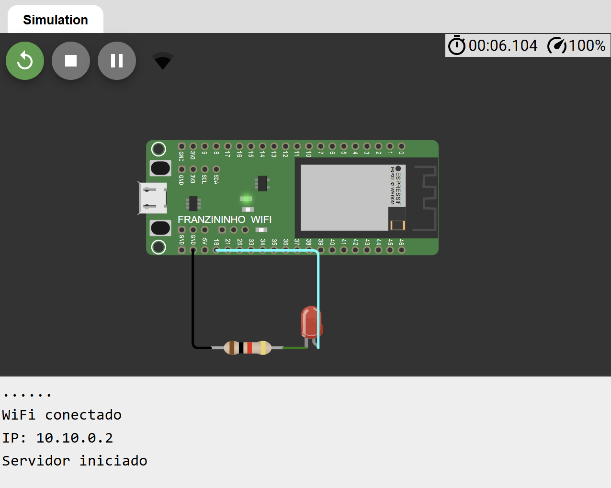

# Control Remoto de LED con ESP32

## Descripción

Proyecto IoT desarrollado con ESP32 que permite controlar remotamente un LED mediante una interfaz web accesible desde cualquier navegador conectado a la misma red.

El ESP32 actúa como un servidor web embebido que recibe solicitudes HTTP para encender o apagar un actuador. En esta simulación, un LED representa el dispositivo controlado remotamente.

Este proyecto introduce conceptos fundamentales de Internet de las Cosas (IoT), comunicación Wi-Fi, servidores HTTP embebidos y control remoto de dispositivos.

---

## Objetivo

Implementar una aplicación web embebida en un ESP32 para controlar el estado de un LED mediante botones de encendido y apagado desde un navegador web.

---

## Componentes Utilizados

* ESP32 DevKit V1
* LED
* Resistencia de 220 Ω
* Wokwi Simulator

---

## Funcionamiento

El ESP32 se conecta a una red Wi-Fi y ejecuta un servidor HTTP.

Cuando un usuario accede al dashboard web:

1. El navegador solicita la página principal.
2. El ESP32 genera dinámicamente una interfaz HTML.
3. El usuario puede encender o apagar el LED mediante botones.
4. El ESP32 recibe la solicitud HTTP y cambia el estado del GPIO correspondiente.

---

## Arquitectura

```text
┌─────────────┐
│ Navegador   │
│ Web         │
└──────┬──────┘
       │ HTTP
       ▼
┌─────────────┐
│    ESP32    │
│ Web Server  │
└──────┬──────┘
       │ GPIO
       ▼
┌─────────────┐
│     LED     │
└─────────────┘
```

---

## Conexiones

| Componente | ESP32                   |
| ---------- | ----------------------- |
| LED (+)    | GPIO18                  |
| LED (-)    | Resistencia 220 Ω → GND |

---

## Diagrama



---

## Simulación en Wokwi

🔗 Simulación:

```text
https://wokwi.com/projects/TU_PROJECT_ID
```

---

## Código

El código fuente se encuentra en:

```text
codigo/sketch.ino
```

---

## Dashboard Web

Ejemplo de interfaz:

```text
ESP32 IoT Control

LED Estado: APAGADO

[ ON ]
[ OFF ]
```

Al presionar el botón ON:

```text
LED Estado: ENCENDIDO
```

Al presionar el botón OFF:

```text
LED Estado: APAGADO
```

---

## Características

* Control remoto mediante navegador web.
* Servidor HTTP embebido en ESP32.
* Interfaz web simple y responsiva.
* Actualización del estado del LED en tiempo real.
* Comunicación mediante Wi-Fi.
* Gestión de GPIO desde solicitudes HTTP.

---

## Conceptos Aplicados

* Internet de las Cosas (IoT)
* ESP32 Wi-Fi
* HTTP Server
* HTML y CSS
* Sistemas embebidos
* Control remoto
* GPIO
* Automatización básica

---

## Tecnologías Utilizadas

* ESP32
* Arduino Framework
* C/C++
* Wi-Fi
* HTTP
* HTML
* CSS
* Wokwi
* Git
* GitHub

---

## Aplicaciones Industriales

* Control remoto de luminarias.
* Automatización de oficinas.
* Domótica.
* Encendido remoto de ventiladores.
* Control de bombas de agua.
* Sistemas de supervisión industrial.
* Automatización de edificios inteligentes.
* Industria 4.0.

---

## Estructura del Proyecto

```text
04-control-remoto-led/
│
├── codigo/
│   └── sketch.ino
│
├── screenshot-circuito.png
│
├── docs/
│   └── README.md
│
└── README.md
```

---

## Mejoras Futuras

* Control de múltiples dispositivos.
* Interfaz web responsiva.
* Autenticación de usuarios.
* Integración con MQTT.
* Dashboard en tiempo real con WebSockets.
* Aplicación móvil para control remoto.
* Integración con asistentes virtuales.

---