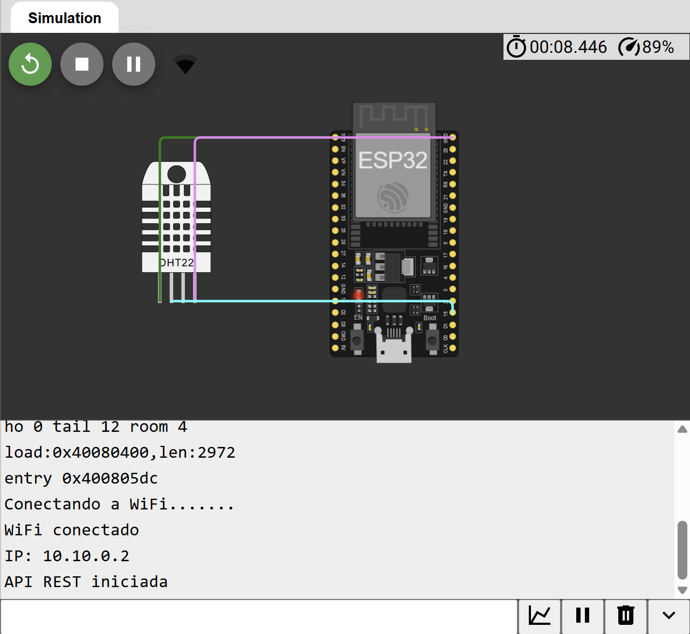

# API REST con ESP32

## Descripción

Proyecto IoT desarrollado con ESP32 y sensor DHT22 que expone una API REST para consultar datos ambientales en formato JSON.

El ESP32 funciona como un servidor HTTP embebido capaz de responder solicitudes REST realizadas desde navegadores, aplicaciones móviles, sistemas SCADA, plataformas IoT o servicios backend.

Este proyecto introduce conceptos fundamentales de integración entre sistemas embebidos y aplicaciones web modernas mediante el uso de APIs REST.

---

## Objetivo

Implementar una API REST utilizando un ESP32 para proporcionar lecturas de temperatura y humedad en formato JSON a través de una red Wi-Fi.

---

## Componentes Utilizados

* ESP32 DevKit V1
* Sensor DHT22
* Wokwi Simulator

---

## Funcionamiento

El ESP32 se conecta a una red Wi-Fi y ejecuta un servidor HTTP.

Cuando un cliente realiza una solicitud al endpoint de la API:

1. El ESP32 obtiene los datos del sensor DHT22.
2. Convierte la información a formato JSON.
3. Envía la respuesta al cliente mediante HTTP.

---

## Arquitectura

```text
┌─────────────┐
│   DHT22     │
└──────┬──────┘
       │
       ▼
┌─────────────┐
│    ESP32    │
│  REST API   │
└──────┬──────┘
       │ HTTP/JSON
       ▼
┌─────────────┐
│ Cliente Web │
│ Postman     │
│ FastAPI     │
│ Dashboard   │
└─────────────┘
```

---

## Conexiones

| DHT22 | ESP32  |
| ----- | ------ |
| VCC   | 3V3    |
| DATA  | GPIO15 |
| GND   | GND    |

---

## Diagrama



---

## Simulación en Wokwi

🔗 Simulación:

```text
https://wokwi.com/projects/TU_PROJECT_ID
```

---

## Código

El código fuente se encuentra en:

```text
codigo/sketch.ino
```

---

## Endpoint Disponible

### Obtener datos del sensor

**Request**

```http
GET /api/sensor
```

**Response**

```json
{
  "temperature": 26.4,
  "humidity": 58.2
}
```

**Status Code**

```http
200 OK
```

---

## Prueba desde Navegador

```text
http://IP_DEL_ESP32/api/sensor
```

Respuesta:

```json
{
  "temperature": 26.4,
  "humidity": 58.2
}
```

---

## Prueba con cURL

```bash
curl http://IP_DEL_ESP32/api/sensor
```

---

## Prueba con Postman

### Método

```http
GET
```

### URL

```text
http://IP_DEL_ESP32/api/sensor
```

---

## Características

* API REST embebida en ESP32.
* Comunicación mediante HTTP.
* Respuestas en formato JSON.
* Lectura de temperatura en tiempo real.
* Lectura de humedad en tiempo real.
* Integración con sistemas externos.
* Arquitectura cliente-servidor.

---

## Conceptos Aplicados

* Internet de las Cosas (IoT)
* REST API
* JSON
* HTTP
* ESP32 Wi-Fi
* Sensores digitales
* Sistemas embebidos
* Integración de sistemas

---

## Tecnologías Utilizadas

* ESP32
* Arduino Framework
* C/C++
* Wi-Fi
* HTTP
* JSON
* DHT22
* Wokwi
* Git
* GitHub

---

## Aplicaciones Industriales

* Telemetría industrial.
* Monitoreo ambiental.
* Agricultura inteligente.
* Sistemas SCADA.
* Industria 4.0.
* Integración con ERP y MES.
* Dashboards de monitoreo.
* Plataformas de análisis de datos.

---

## Casos de Integración

Este endpoint puede ser consumido por:

* Aplicaciones desarrolladas con FastAPI.
* Aplicaciones desarrolladas con Django REST Framework.
* Dashboards en React.
* Aplicaciones móviles.
* Sistemas de monitoreo industrial.
* Plataformas IoT en la nube.
* Servicios AWS.

---

## Estructura del Proyecto

```text
05-api-rest-esp32/
│
├── codigo/
│   └── sketch.ino
│
├── screenshot-circuito.png
│
├── docs/
│   └── README.md
│
└── README.md
```

---

## Mejoras Futuras

* Múltiples endpoints REST.
* Autenticación mediante API Key.
* Integración con bases de datos.
* Envío de datos a FastAPI.
* Publicación mediante MQTT.
* Integración con AWS IoT Core.
* Dashboard web en tiempo real.
* Historial de mediciones.

---
